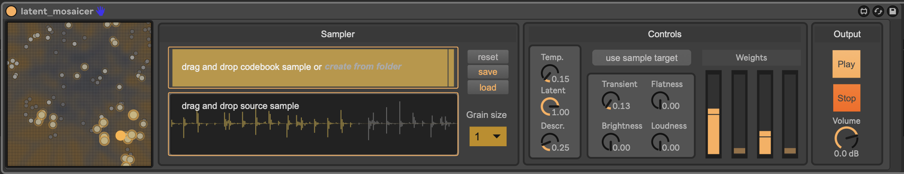

# latent_mosaicer

Max for Live audio device for latent-space granular mosaicing.



## Demo

<video src="figures/demo_final.mp4" controls width="100%"></video>

[Download the demo video](figures/demo_final.mp4)

## Overview

This folder contains the packaged Max for Live device and the runtime assets it needs:

- `latent_mosaicer.amxd`
- `src/models/*.ts` for `music2latent2` and the descriptor predictors
- `src/frontend/*.js` for the waveform and latent-space UI
- `src/external/latent_mosaicer.mxo` for the custom Max external

# More audio examples

| Example | orig | codebook | brightness | flatness | loudness | transient | no_control |
|---|---:|---:|---:|---:|---:|---:|---:|
| `example_01` | <br/><audio controls preload="none" src="audio_examples/example_01_orig.wav"></audio> | <audio controls preload="none" src="audio_examples/example_01_codebook.wav"></audio> | <audio controls preload="none" src="audio_examples/example_01_brightness.wav"></audio> | <audio controls preload="none" src="audio_examples/example_01_flatness.wav"></audio> | <audio controls preload="none" src="audio_examples/example_01_loudness.wav"></audio> | <audio controls preload="none" src="audio_examples/example_01_transient.wav"></audio> | <audio controls preload="none" src="audio_examples/example_01_no_control.wav"></audio> |
| `example_02` | <br/><audio controls preload="none" src="audio_examples/example_02_orig.wav"></audio> | <audio controls preload="none" src="audio_examples/example_02_codebook.wav"></audio> | <audio controls preload="none" src="audio_examples/example_02_brightness.wav"></audio> | <audio controls preload="none" src="audio_examples/example_02_flatness.wav"></audio> | <audio controls preload="none" src="audio_examples/example_02_loudness.wav"></audio> | <audio controls preload="none" src="audio_examples/example_02_transient.wav"></audio> | <audio controls preload="none" src="audio_examples/example_02_no_control.wav"></audio> |

The first example displays a compatible codebook/target pair.
The second example shows the device's limitation when expected features are not reachable in the target domain. Steering parameters does not have a great influence on the final audio output.


## Device Features

- latent codebook construction from one file or a folder of files
- source-driven mosaicing in the `music2latent` latent space
- descriptor-aware retrieval using loudness, transientness, brightness, and flatness
- interpolation between latent similarity and descriptor similarity through `w_latent` and `w_desc`
- optional source-driven goals via `use_source_goals`
- codebook save/load for reusing curated corpora

## Repository Layout

This package:

- `latent_mosaicer/latent_mosaicer.amxd`
- `latent_mosaicer/src/models/music2latent2.ts`
- `latent_mosaicer/src/models/descriptor_*.ts`
- `latent_mosaicer/src/frontend/source_waveform_ui.js`
- `latent_mosaicer/src/frontend/umap_plot.js`
- `latent_mosaicer/src/external/latent_mosaicer.mxo`

## Requirements

- macOS
- Ableton Live with Max for Live
- Max configured to see this folder's `src/` directory

Apple Silicon is the primary target. The current package is set up for local TorchScript inference from Max.

## Installation

1. Clone or copy the repository locally.
2. In Max, add `[latent_mosaicer/src)` to `Options > File Preferences`.
3. Load `[latent_mosaicer/latent_mosaicer.amxd)` in Ableton Live.
4. If macOS blocks the external, run:

```bash
xattr -dr com.apple.quarantine /path/to/latent_mosaicer/src/external/latent_mosaicer.mxo
```

5. If re-signing is required, run:

```bash
codesign --force --deep --sign - /path/to/latent_mosaicer/src/external/latent_mosaicer.mxo
```

## Usage

1. Insert `latent_mosaicer.amxd` on an audio track in Ableton Live.
2. Build a codebook:
   - drag a `.wav` file into the codebook area to initialize a codebook
   - drag more audio to append material to the current codebook
   - use `Create from folder` to rebuild from a folder of `.wav` files
   - use `Reset`, `Save`, and `Load` to manage codebook state
3. Load the source audio in the source area.
4. Set `grain_size` to choose the temporal scale of retrieval.
5. Start audio playback.
6. Adjust the retrieval behavior:
   - `tau` controls sampling temperature
   - `w_latent` weights latent similarity
   - `w_desc` weights descriptor similarity
   - descriptor goals control `transient`, `flatness`, `brightness`, and `loudness`
   - `use_source_goals` switches from user-imposed goals to source-driven descriptor trajectories
7. Use the output gain control for final level adjustment.


## Troubleshooting

- Clicks can appear in Ableton Live environnement when moving the different controls. Try to increase buffer size and close heavy running programs.
- `latent_mosaicer` cannot be loaded because of system security policy
  - remove quarantine and re-sign the `.mxo`
- no audio output
  - check DSP status, Live routing, and that both source and codebook are loaded
- UI does not update
  - verify that Max can resolve `src/frontend`
- models do not load
  - verify that the TorchScript files are present in `src/models`
